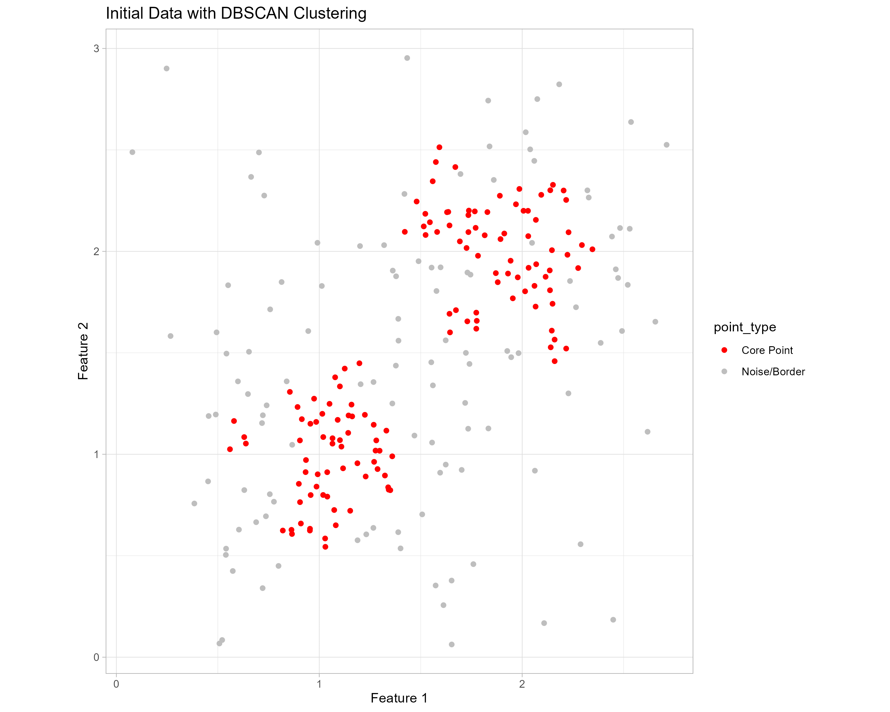
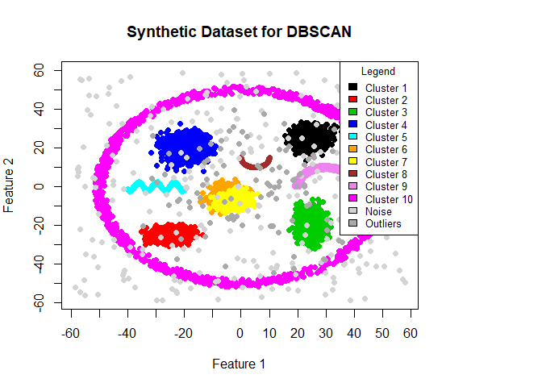

Maciej Kuchciak
January 2024

- [Abstract](#abstract)
- [Introduction](#introduction)
  - [Overview of clustering in Unsupervised
    Learning](#overview-of-clustering-in-unsupervised-learning)
  - [Significance of DBSCAN](#significance-of-dbscan)
- [Methodology](#methodology)
  - [Understanding DBSCAN](#understanding-dbscan)
    - [Core Concepts](#core-concepts)
    - [Reachability and Connectivity](#reachability-and-connectivity)
    - [Visualization of DBSCAN](#visualization-of-dbscan)
  - [Selection of Synthetic Dataset](#selection-of-synthetic-dataset)
- [Results and Analysis](#results-and-analysis)
  - [Exploration of eps and minPts](#exploration-of-eps-and-minpts)
    - [Effects of Varying eps](#effects-of-varying-eps)
    - [Influence of minPts on Cluster
      Formation](#influence-of-minpts-on-cluster-formation)
  - [First Optimization](#first-optimization)
  - [Normalization and Its Impact](#normalization-and-its-impact)
- [Discussion](#discussion)
  - [Insights and Implications of
    Findings](#insights-and-implications-of-findings)
  - [Challenges and Limitations
    Encountered](#challenges-and-limitations-encountered)
- [Conclusion](#conclusion)
  - [Summary of Key Findings](#summary-of-key-findings)
  - [Future Research Directions](#future-research-directions)

------------------------------------------------------------------------

## Abstract

This study focuses on the exploration of DBSCAN (Density-Based Spatial
Clustering of Applications with Noise), a non-parametric clustering
algorithm known for its proficiency in **identifying clusters of varied
shapes and sizes**, and its great performance in the **identifying
presence of noise and outliers**.

A synthetic dataset created to emulate data that could show capabilities
of the technique will be used for This research.

The methodology includes a parameter optimization process highlighting
the sensitivity of DBSCAN to the used parameters (epsilon and minPts).


## Introduction

### Overview of clustering in Unsupervised Learning

Clustering is a fundamental technique in unsupervised machine learning.
It involves organizing a set of objects to ensure that items in the same
group, or cluster, are more similar to each other than to those in other
groups or clusters.


### Significance of DBSCAN

DBSCAN (Density-Based Spatial Clustering of Applications with Noise)
stands out among clustering algorithms for its ability to find arbitrary
shaped clusters and its robustness to outliers, which often pose
significant challenges in real-world data analysis.


## Methodology

### Understanding DBSCAN

DBSCAN is a popular clustering algorithm that excels in discovering
clusters of varying shapes and sizes in a dataset, differentiating it
from algorithms that identify clusters based on distance from centroid
or density threshold alone. Its effectiveness in identifying outliers or
noise and its requirement of only two parameters (epsilon (ε) and
minimum points (minPts)) make it versatile and widely applicable.


#### Core Concepts

**Epsilon (ε)**: This parameter sets the radius of the neighborhood
around each point. It defines the distance within which points are
considered to be in the same area

**Minimum Points (minPts)**: This parameter is the minimum number of
points required to form a region, which is considered a cluster.

Based on these parameters, points in the dataset are classified as:

***Core Points***: A point is a core point if at least minPts points are
within distance ε of it, including the point itself. These points are
essential for the formation of a cluster.

***Directly Reachable Points***: A point q is reachable from another
point p if q is within distance ε from p, and p is a core point. This
relation is not symmetric, meaning q being directly reachable from p
does not necessarily imply p is directly reachable from q.

***Reachable Points***: A point q is reachable from p if there exists a
path p1, …, pn from p to q, where each consecutive point is directly
reachable. This chain implies that the intermediate points are core
points, possibly except for q.

***Noise Points***: Noise Points: Points that are not directly reachable
from any other point based on the specified parameters of the clustering
algorithm are considered noise or outliers.


#### Reachability and Connectivity

**Reachability**: It is defined in terms of direct reachability, where a
point is considered reachable from another if there exists a sequence of
points connecting the two, with each point being directly reachable from
the preceding one.

**Connectivity**: Two points are density-connected if there exists a
point from which both are reachable, based on the direct reachability
criterion. This concept ensures that all points in a cluster are
mutually reachable, ensuring the cluster’s cohesion (compactness).


#### Visualization of DBSCAN

The animation below sequentially showcases the following key stages of
the DBSCAN clustering process:

**Initial Clustering Attempt**: The first part of the animation displays
the initial state of the data before clustering, providing a visual
baseline of the dataset’s distribution. This stage sets the context for
DBSCAN’s impact.

**Epsilon Neighborhood for a Core Point**: Next, the animation
highlights the ε-neighborhood around a selected core point. This
visualization demonstrates how the epsilon parameter influences the
identification of directly reachable points. It emphasizes the role of ε
in determining the density requirement for cluster formation.

**Epsilon Neighborhoods for All Core Points**: The final segment extends
the ε-neighborhood visualization to all core points in the dataset. This
comprehensive view illustrates the clustering process across the entire
dataset, showing how individual clusters are formed based on core and
directly reachable points. It also visually represents noise points or
outliers that do not belong to any cluster.

<figure>

<figcaption aria-hidden="true">Process of DBSCAN</figcaption>
</figure>


### Selection of Synthetic Dataset

The synthetic dataset was generated using the following approach:

- **Cluster Centers and Sizes:** Defined specific centers for each
  cluster and determined the number of points (sizes) to simulate
  varying densities.

- **Diverse Shapes:** Utilized mathematical functions and distributions
  to create clusters of different shapes, such as circular (“ring”
  shape) and sinusoidal patterns, to challenge the clustering algorithm
  beyond simple spherical clusters.

- **Noise and Outliers:** Added random noise and outliers to assess
  DBSCAN’s robustness in identifying and segregating these elements from
  the main clusters.

``` r
library(dbscan) # For clustering
library(ggplot2) # For plotting # graphs made with both ggplot2 and plot
library(MASS) # For generating synthetic data using multivariate normal distribution
```

``` r
# Set a seed for reproducibility
set.seed(420)
```

``` r
# Define the cluster centers and sizes
centers <- matrix(c(25, 25, -25, -25, 25, -20, -20, 20), ncol = 2, byrow = TRUE) 
sizes <- c(1000, 1000, 1000, 1000, 1000, 1000, 1000, 1000, 1000, 1000, 250, 100)

# Generate synthetic clusters with different characteristics
cluster1 <- mvrnorm(n = sizes[1], mu = centers[1,], Sigma = matrix(c(9, 2, 2, 9), ncol = 2))
cluster2 <- mvrnorm(n = sizes[2], mu = centers[2,], Sigma = matrix(c(12, 0.5, 0.5, 4), ncol = 2))
cluster3 <- mvrnorm(n = sizes[3], mu = centers[3,], Sigma = matrix(c(6, 0.3, 0.3, 18), ncol = 2))
cluster4 <- mvrnorm(n = sizes[4], mu = centers[4,], Sigma = matrix(c(15, 0.1, 0.1, 15), ncol = 2))

# Cluster 5: Sine curve distribution
x_values <- seq(-40, -20, length.out = 1000)
y_values <- sin(x_values) * 2 + rnorm(1000, mean = 0, sd = 0.2) # Adding some noise to the sine curve
cluster5 <- cbind(x_values, y_values)

# Cluster 6 & 7: Intersecting clusters
cluster6 <- mvrnorm(n = 1000, mu = c(-5, -5), Sigma = matrix(c(7, 1.3, 1.3, 8), ncol = 2))
cluster7 <- mvrnorm(n = 1000, mu = c(-3, -7), Sigma = matrix(c(7, 1.3, 1.3, 5), ncol = 2))

# Cluster 8: Points along an arc
theta <- runif(1000, min = pi, max = 2 * pi)
r <- 5
cluster8 <- cbind(r * cos(theta) + 5, r * sin(theta) + 15)

# Cluster 9: Points in a "moon" shape
theta <- runif(1000, min = 0, max = pi)
r <- 10 + runif(1000, min = -1, max = 1)
cluster9 <- cbind(r * cos(theta) + 30, r * sin(theta))

# Cluster 10: Points in a "ring" shape around all other clusters
theta <- runif(1000, min = 0, max = 2 * pi)
r_inner <- 48
r_outer <- 52
r <- sqrt(runif(1000, min = r_inner^2, max = r_outer^2))
cluster10 <- cbind(r * cos(theta), r * sin(theta))
```

Merging clusters and introducing both noise and outliers

- Noise consists of random or irrelevant data points that don’t form any
  clear patterns and typically represent background variability.
- Outliers, are data points that differ from other observations by a
  huge margin, potentially indicating unique or rare phenomena within
  the dataset.

``` r
# Combine all clusters into a single dataset
data <- rbind(cluster1, cluster2, cluster3, cluster4, cluster5, cluster6, cluster7, cluster8, cluster9, cluster10)

# Generate noise and outliers within a limited range
noise <- cbind(runif(sizes[11], min = -60, max = 60), runif(sizes[11], min = -60, max = 60))
outliers <- cbind(rnorm(sizes[12], mean = 0, sd = 20), rnorm(sizes[12], mean = 0, sd = 20))

# Combine clusters, noise, and outliers
data <- rbind(data, noise, outliers)
```

The output of the code above for plotting is a two-dimensional scatter
plot, visually representing a synthetic dataset designed for evaluating
the DBSCAN clustering algorithm.

Plot below showcases a variety of clusters, each differentiated by
unique colors, indicating distinct groupings within the data.

Additionally, noise and outliers are also highlighted, with noise points
depicted in light gray and outliers in dark gray

<!-- -->

Additionaly Hopkins statistics was used to assess whether the data has a
clustering tendency. The higher values the better.

    ## [1] 0.9524216

The Hopkins statistic value of approximately 0.953 suggests a high
likelihood that the dataset has a significant clustering tendency. This
means the data is likely not uniformly distributed and has potential
clusters. Which means that synthetic data for clustering was created
successfully.


## Results and Analysis

### Exploration of eps and minPts

#### Effects of Varying eps

Too low eps can cause over-segmentation. It is when algorithm detects
too many clusters. This often results in meaningful clusters being split
into smaller, disjointed parts, with potentially more points classified
as noise.

Eps of 0.5 was chosen for lower end to show this problem.

<!-- -->

On the other hand, too high eps can cause under-segmentation. It’s when
distinct clusters are merged into a single cluster or where sparse
points are incorrectly included in nearby clusters. This can mask the
true diversity and distribution of the data points.

<!-- -->


#### Influence of minPts on Cluster Formation

As a rule of thumb, a starting point for minPts can be derived from the
dimensionality of the dataset. A common suggestion is to set minPts to
at least the dimensionality of the data plus one (D + 1), where D is the
number of dimensions. Sometimes it can also be choosen as D\*2.

A low value for minPts can lead to a higher likelihood of identifying
noise points as part of clusters, reducing the algorithm’s ability to
filter out outliers. It may also result in the detection of numerous
small clusters, reflecting a more fragmented clustering structure than
actually present.

<!-- -->

High minPts value increases the robustness of the algorithm to noise by
requiring a larger number of points to establish a cluster. However,
this can also prevent the formation of valid clusters in less dense
regions of the dataset, potentially overlooking significant but less
dense structures.

<!-- -->

### First Optimization

In optimizing DBSCAN parameters, minPts was set to twice the dataset’s
dimensionality (4 for a 2 D dataset). The optimal epsilon was determined
using a k-distance graph with k set to minPts - 1 (3 in this case),
identifying the “elbow” point to define the radius for neighborhood
searches.

<!-- -->

<!-- -->

As “elbow” point is not clear, the graph was zoomed in and then the
epsilon was checked iteratively between values 1 and 2.5.

For epsilon = 2.5 and minPts = 4 (2\*2) parameters, the result was the
closes to syntheticly created dataset. Unfortunetelly the intersected
clusters were not properly discovered, but that’s logical, the distance
between points there was too small.

<!-- -->

### Normalization and Its Impact

Normalization was used to ensure that all features contribute equally to
the distance calculations in the clustering algorithm. Just to see
wether it would help with accesing better clusters, or worsen the
results (originally, scale was very similar so it should not matter that
much).

Firsly, the non-optimized version was run, and k-distance graph was
checked for epsilon value.

<!-- -->

<!-- -->

Based on the graph of k-distance, the values from range 0.01 to 0.2 were
iteratively checked, for best outcome compared with synthetic dataset
graph and the previous non normalized clustering graph.

<!-- -->

The results post-normalization were a bit better, we did remove one
cluster that was supposed (?) to discover some outliers, and after
normalization it did thse points added into outliers cluster, but except
for that, the results did not differ that much (usage of normal, based
on real-life data datasets or with more sparsed data would be
recommended in the future)


## Discussion

### Insights and Implications of Findings

The application of DBSCAN to normalized data (also to non-normalized
data) revealed distinct clusters that correspond to the inherent
grouping within synthetic dataset. This demonstrates the algorithm’s
ability to detect clusters of various shapes and densities, showing its
versatility in different data contexts and ability to discover noise and
outliers proficiently (although not differentiating between them, but
that may be due to the choice of dataset). The normalization process
proved to be a thing that Did better the performance (even if it is only
slight increase of it) of algorithm in this case, although the data was
initially created with small margin of differences in distances between
points so It Does not show the full potential of normalization and
should be researched in future approaches.


### Challenges and Limitations Encountered

A key challenge in this analysis was determining the optimal epsilon and
minPts parameters. The choice of these parameters is a main factor that
affects the number and composition of the clusters. Furthermore,
DBSCAN’s sensitivity to these settings poses a limitation, as it
requires domain knowledge or heuristics to guide the selection process,
which may not always be readily available. The dataset was not that big
so the processes were not taking much time; it is hard to evaluate the
speed of algorithm and its scalability based on this research.


## Conclusion

### Summary of Key Findings

While normalization played a role in enhancing DBSCAN’s outlier
detection capabilities, its impact was somewhat limited in dataset due
to the dense clustering of data points. Nevertheless, normalization
provided advantages such as aiding in parameter tuning. It ensured fair
feature representation and helped the adjustment of the epsilon value
for optimal clustering performance. While normalization did not
significantly affect the outcomes, it supported fair feature
representation and better parameter optimization (as mentioned earlier,
to be researched in next attempts).


### Future Research Directions

Future work may explore automated methods for parameter selection, such
as utilizing silhouette scores or other cluster validation metrics.
Additionally, investigating the impact of normalization techniques
beyond basic scaling, like robust scalers or non-linear transformations,
could provide further insights into the preprocessing requirements of
DBSCAN in diverse datasets. Using regular real-life dataset instead of
synthetically created one could also give much more options to use such
techniques.
